# Slambook2 Note
code of 14 lectures on visual SLAM 2nd built on Windows 10 using WSL(Ubuntu 16.04)

## Table of Content
* [Thirdparty](#thirdparty)
  * [CMake](#cmake)
  * [Eigen](#eigen)
  * [Pangolin](#pangolin)
  * [fmt](#fmt)
  * [Sophus](#sophus)
  * [OpenCV](#opencv)
  * [Boost](#boost)
  * [g2o](#g2o)
  * [gflags](#gflags)
  * [glog](#glog)
  * [ceres-solver](#ceres-solver)
  * [DBo3](#dbow3)
  * [vtk](#vtk)
  * [pcl](#pcl)
  * [octomap](#octomap)
* [DEMO](#demo)
  * [visualizeGeometry](#visualizegeometry) 
  * [trajectoryError](#trajectoryerror) 
  * [stereoVision](#stereovision)
  * [joinMap](#joinmap)
  * [curveFitting](#curvefitting)
  * [orb_cv](#orb_cv)
  * [orb_self](#orb_self)
  * [optical_flow](#optical_flow)
  * [direct_method](#direct_method)
  * [bundle_adjustment](#bundle_adjustment)
  * [myslam](#myslam)
* [IDE](#ide)
* [References](#references) 

## Thirdparty
若想安裝`CMake`以外的第三方函示庫(含Python的)可執行`build.sh`來安裝
```shell
sh build.sh
```

### CMake
Ubuntu 16.0 預設Cmake版本是3.5，但版本過舊，所以使用Cmake編譯一些第三方函式庫時會有問題，因此建議使用以下指令來更新到3.16以上
```shell
sudo apt-get install build-essential
wget http://www.cmake.org/files/v3.16/cmake-3.16.0.tar.gz
tar xf cmake-3.16.0.tar.gz
cd cmake-3.16.0
./configure
cmake .
make
sudo make install
```

接著，為了解決路徑問題，所以要加到環境變數
```shell
sudo gedit ~/.bashrc
```

在.bashrc中加入以下兩行
```shell
export PATH=/usr/local/bin:$PATH
export LD_LIBRARY_PATH=/usr/local/lib:$LD_LIBRARY_PATH
```

再來更新環境變數
```shell
source ~/.bashrc
```

最後使用以下指令即可看到新版的Cmake
```shell
cmake --version
```

### Eigen
輸入此指令安裝
```shell
wget https://gitlab.com/libeigen/eigen/-/archive/3.3.9/eigen-3.3.9.zip
unzip eigen-3.3.9.zip
cd eigen-3.3.9
mkdir build && cd build
cmake ..
make
sudo make install
```

### Pangolin
先用此指令安裝Glew
```shell
sudo apt-get install libglew-dev
```

再照著以下步驟安裝
```shell
git clone https://github.com/stevenlovegrove/Pangolin.git
cd Pangolin
mkdir build && cd build
cmake ..
cmake --build .
```

### fmt
照以下步驟安裝
```shell
git clone  https://github.com/fmtlib/fmt.git
cd fmt
mkdir build && cd build
cmake ..
make
sudo make install
```

### Sophus
照以下步驟安裝
```shell
git clone http://github.com/strasdat/Sophus.git
cd Sophus
mkdir build && cd build
cmake ..
sudo make install
```
如果用到模板類的Sophus需要進行以下更改

`SE3`需要`#include<sophus/se3.h>`

`SO3`需要`#include<sophus/so3.h>`

`SE3d`與`SO3d`改成用模板類別，因此改成`SE3`與`SO3`

### OpenCV
安裝`3.4.3`，照以下步驟
```shell
sudo apt-get install build-essential cmake
wget https://github.com/opencv/opencv/archive/3.4.3.zip
unzip 3.4.3.zip
cd opencv-3.4.3
mkdir -p build && cd build
cmake ..
make
sudo make install
```

### Boost
使用此指令安裝
```shell
sudo apt-get install libboost-all-dev
```

### g2o
先安裝依賴庫
```shell
sudo apt-get install libsuitesparse-dev
```

使用
```shell
qmake -v
```
確認QT版本是否為5，這樣使用`g2o_viewer`才不會有問題

再照以下步驟安裝
```shell
git clone https://github.com/RainerKuemmerle/g2o.git
cd g2o
mkdir build && cd build
cmake ..
make
sudo make install
```

### gflags
照以下步驟安裝
```shell
git clone https://github.com/gflags/gflags
cd gflags
mkdir build && cd build
cmake ..
make
sudo make install
```

### glog
照以下步驟安裝
```shell
git clone https://github.com/google/glog
cd glog
mkdir build && cd build
cmake ..
make
sudo make install
```

### ceres-solver
照以下步驟安裝
```shell
git clone https://github.com/ceres-solver/ceres-solver.git
cd ceres-solver
mkdir build && cd build
cmake ..
make
sudo make install
```

### DBow3
照以下步驟安裝
```shell
git clone https://github.com/rmsalinas/DBow3.git
cd DBow3
mkdir build && cd build
cmake ..
make
sudo make install
```

### vtk
照以下步驟安裝
```shell
wget https://www.vtk.org/files/release/8.2/VTK-8.2.0.zip
unzip VTK-8.2.0.zip
cd VTK-8.2.0
mkdir -p build && cd build
cmake ..
make
sudo make install
```

### pcl
照以下步驟安裝
```shell
wget https://github.com/PointCloudLibrary/pcl/archive/refs/tags/pcl-1.9.1.zip
unzip pcl-1.9.1.zip
cd pcl-pcl-1.9.1
mkdir -p build && cd build
cmake ..
make
sudo make install
```

### octomap
照以下步驟安裝
```shell
git clone https://github.com/OctoMap/octomap.git
cd octomap
mkdir build && cd build
cmake ..
make
sudo make install
```

## DEMO
### visualizeGeometry
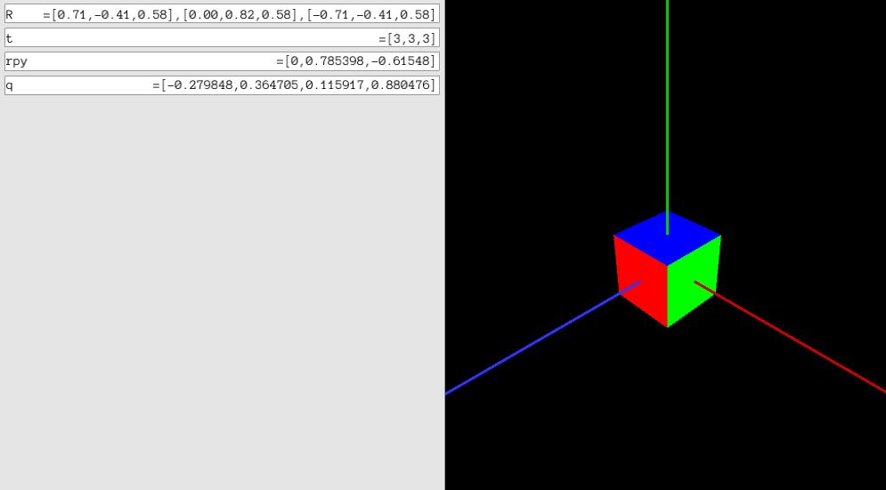

### trajectoryError
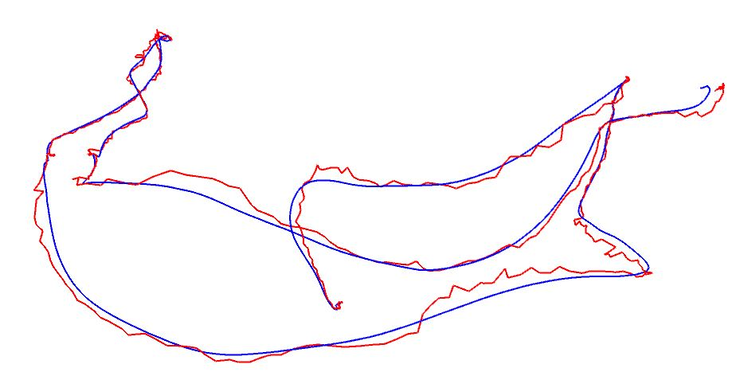

### stereoVision
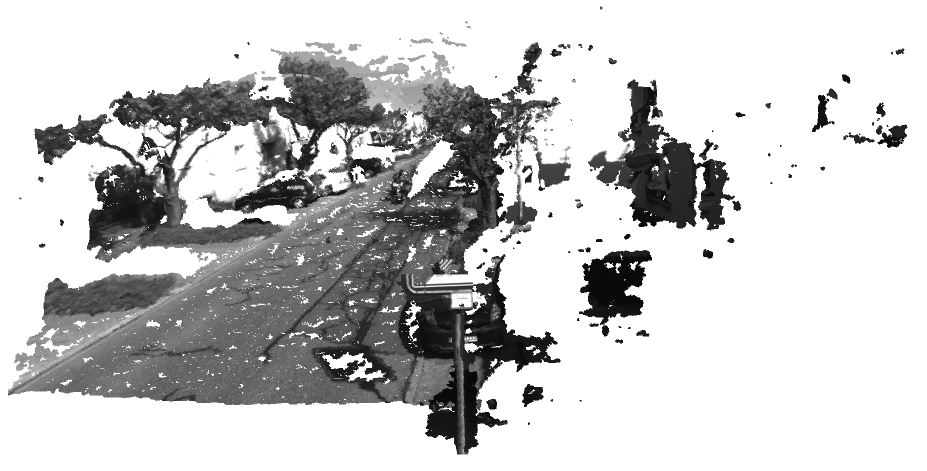

### joinMap
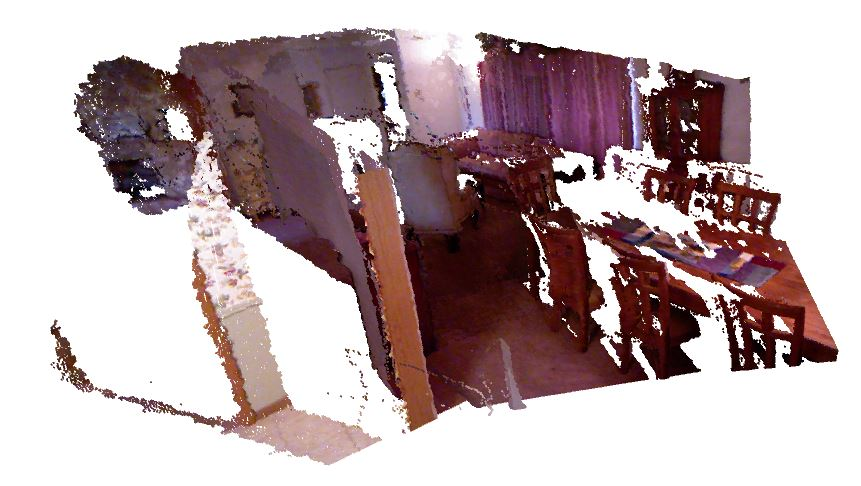

### curveFitting
|Gauss Newton|ceres-solver|g2o|
|-|-|-|
|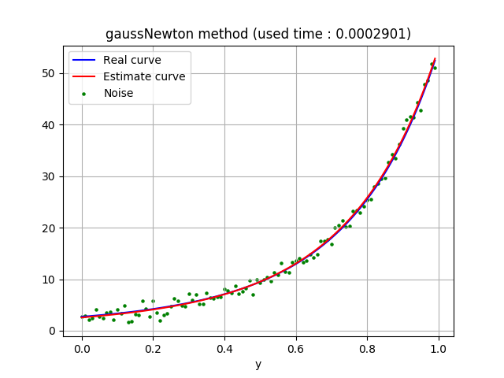||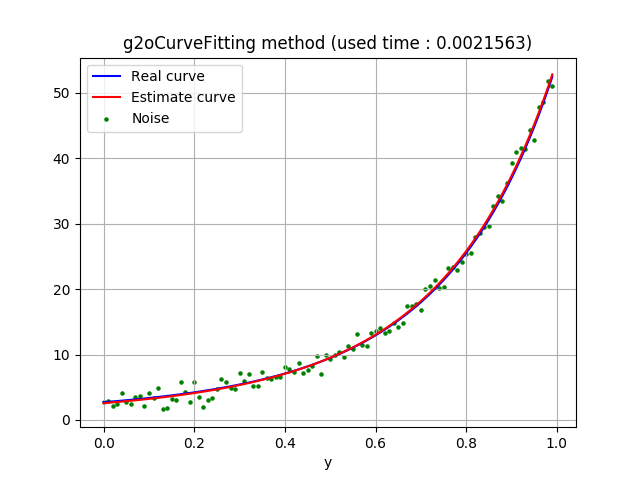|

### orb_cv
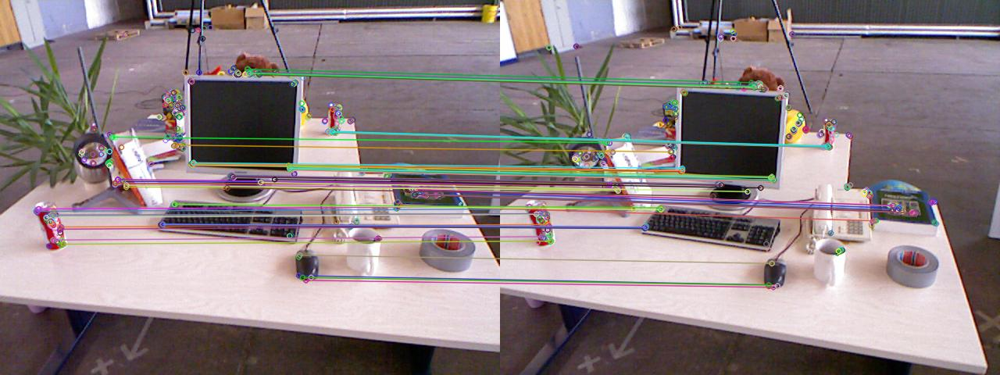

### orb_self
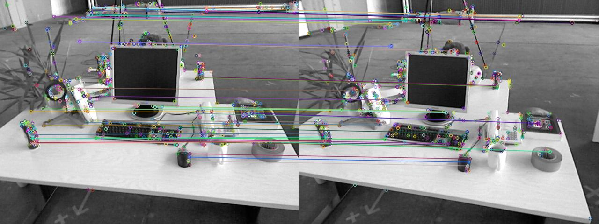

### optical_flow
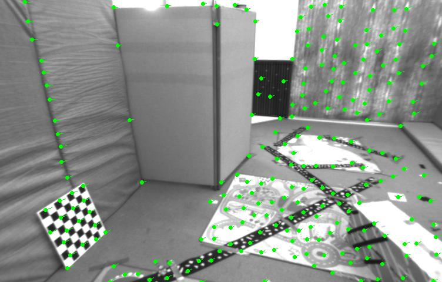

### direct_method
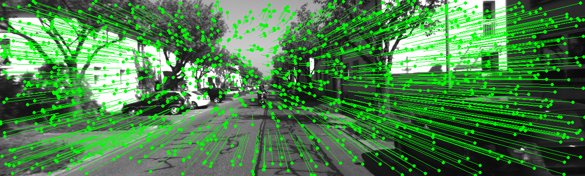

### bundle_adjustment
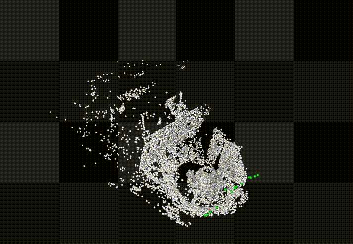

### myslam


## IDE
Visual studio code 

* Visual Studio Code Extensions  
  * C/C++ : [Link](https://marketplace.visualstudio.com/items?itemName=ms-vscode.cpptools)
  * Remote - WSL : [Link](https://marketplace.visualstudio.com/items?itemName=ms-vscode-remote.remote-wsl)
  * Python : [Link](https://marketplace.visualstudio.com/items?itemName=ms-python.python)
  * CMake : [Link](https://marketplace.visualstudio.com/items?itemName=twxs.cmake)
  * CMake Tools : [Link](https://marketplace.visualstudio.com/items?itemName=ms-vscode.cmake-tools)
  * vscode-3d-preview : [Link](https://marketplace.visualstudio.com/items?itemName=tatsy.vscode-3d-preview)

## References
* github : https://github.com/gaoxiang12/slambook2
* SLAM視覺十四講：雙倍內容強化版 (`ISBN：9789865501044`)

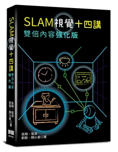
